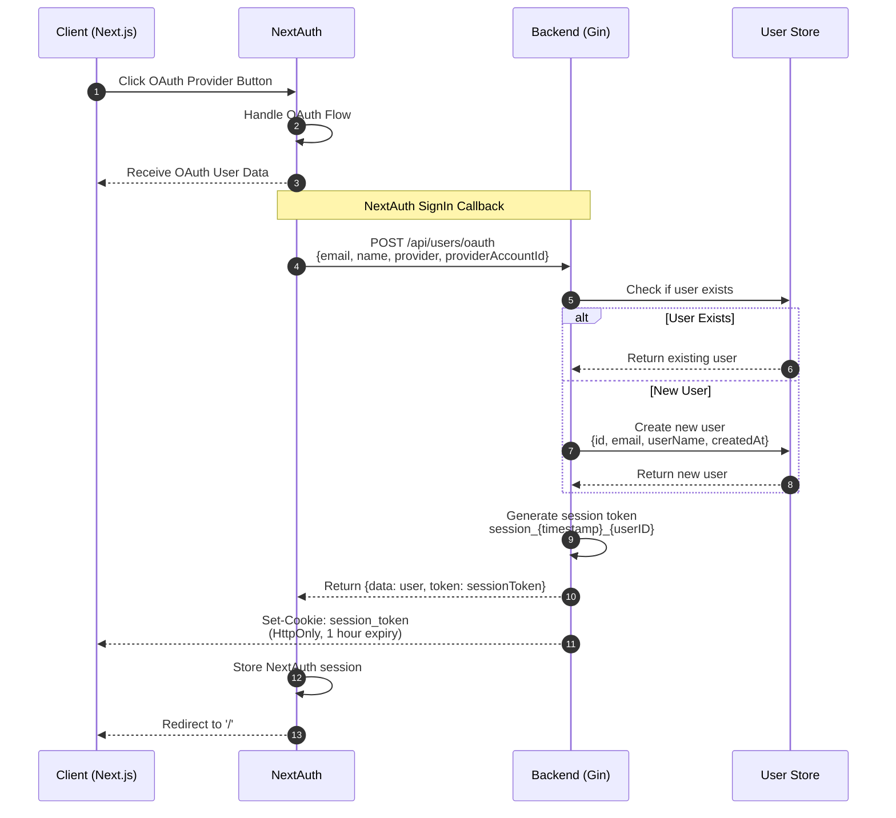
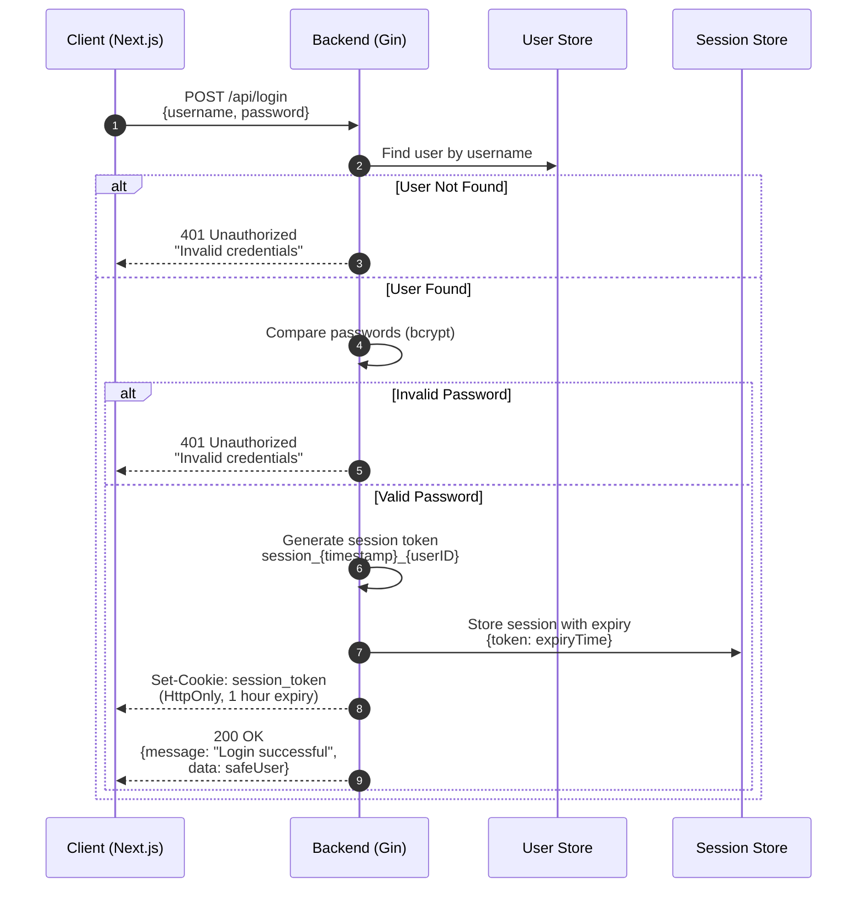
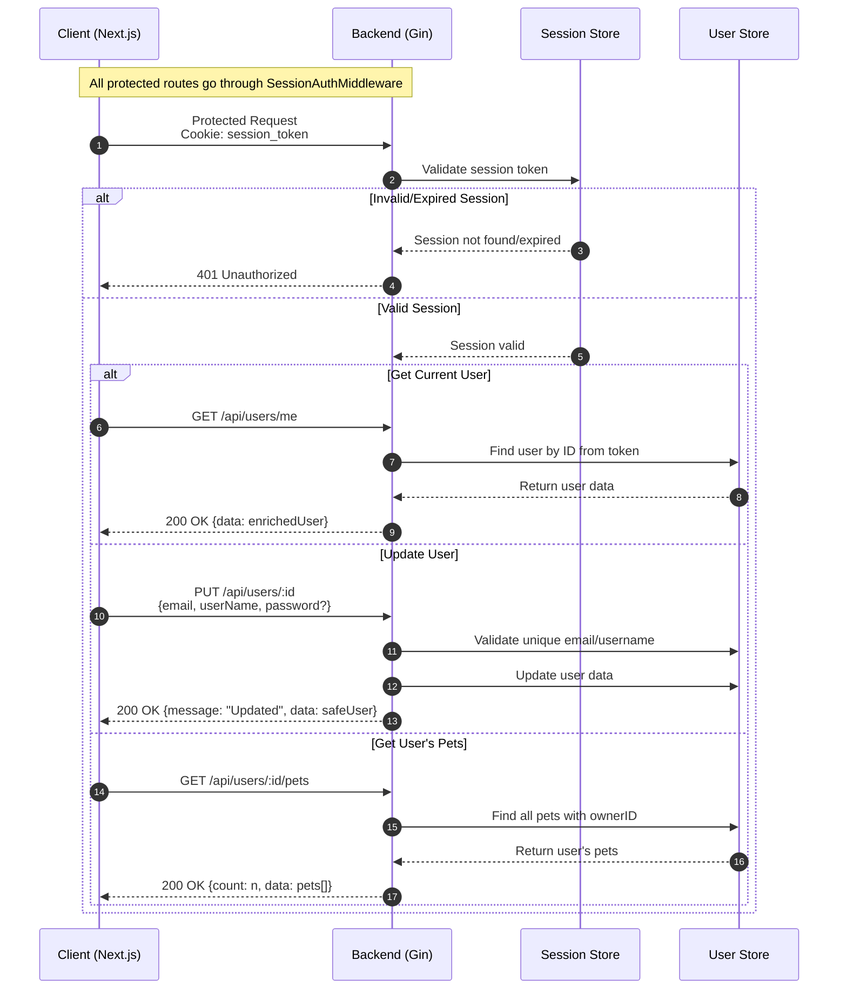

# Authentication and User Flow Sequence Diagrams

This document details the various authentication and user flows in the application using sequence diagrams.

## OAuth Authentication Flow



## Traditional Login Flow



## User Operations Flow



## Data Types and Structures

### User Model
```typescript
interface User {
    ID: string;
    Email: string;
    UserName: string;
    Password: string;  // Hashed with bcrypt
    CreatedAt: string; // RFC3339 format
}
```

### Pet Model
```typescript
interface Pet {
    ID: string;
    Name: string;
    Species: string;
    OwnerID: string;
    CreatedAt: string;
}
```

### Session Store
```typescript
interface SessionStore {
    [sessionToken: string]: Date; // Expiry time
}
```

## API Endpoints Overview

### Authentication Endpoints
- `POST /api/login` - Traditional login
- `POST /api/logout` - Clear session
- `POST /api/users/oauth` - OAuth user creation/login

### User Endpoints
- `GET /api/users` - List all users
- `GET /api/users/me` - Get current user
- `GET /api/users/:id` - Get user by ID
- `POST /api/users` - Create new user
- `PUT /api/users/:id` - Update user
- `DELETE /api/users/:id` - Delete user
- `GET /api/users/:id/pets` - Get user's pets

### Pet Endpoints
- `GET /api/pets` - List all pets
- `GET /api/pets/:id` - Get pet by ID
- `GET /api/pets/owner/:ownerId` - Get pets by owner
- `POST /api/pets` - Create new pet
- `PUT /api/pets/:id` - Update pet
- `DELETE /api/pets/:id` - Delete pet

## Security Notes

1. **Password Security**
   - Passwords are hashed using bcrypt
   - Salt rounds: Default cost (10)

2. **Session Security**
   - Sessions expire after 1 hour
   - Cookies are HttpOnly
   - CORS configured for localhost:1234 and localhost:3000

3. **Data Protection**
   - Passwords are never sent back to client
   - User data is sanitized using `CreateSafeUser`
   - Email uniqueness is enforced
   - Username uniqueness is enforced